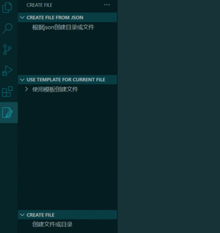

# vscode-create-file - Create New (Template) Files and Directories Based on A Json File or From the Command Panel.

> VS Code 1.63+

This includes:
- An activity bar
- Creating and showing a custom webview
- Quickly create files or directories(You can also use the shortcut keys ctrl+alt+i or cmd+alt+i)
- Create a file using a template(Including vue template, vue+ts template, vue3 template, react template, etc.)
- The current directory structure can be viewed in a custom webview
- Can format json data
- Can generate directory based on json data and support preview
- Sending message from an extension to a webview
- Sending messages from a webview to an extension
- Using a basic content security policy
- Webview lifecycle and handling dispose
- Write the content of webview using react and antd

## How to use

**Enjoy!**
